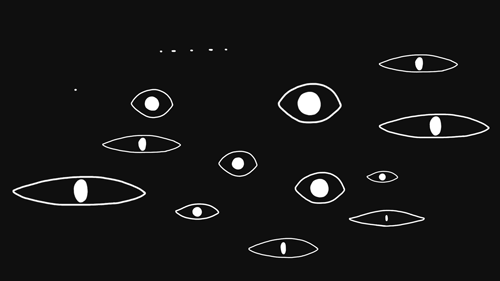

<p align="center">
  
</p>

<h1 align="center"><code>eye@cachyos:~$ whoami</code></h1>

<p align="center">
  Developer in progress · language learner · Linux enthusiast
</p>

<p align="center">
  
  
  
</p>

```text
OS       : CachyOS
WM       : Hyprland
Editor   : VSCodium
Shell    : Caelestia
Uptime   : 3+ years on Linux
Mission  : learn deeply, build useful things, stay curious
```

## `$ cat about-me.txt`

I am a developer and language learner who enjoys the overlap between software, stories, translation, and communication. I am still building my foundations, but I like taking small personal experiments far enough that they become tools I can genuinely use.

Linux has been home for more than three years. I currently run **CachyOS with Hyprland**, and half the fun is shaping the system itself: tuning the workflow, understanding what happens under the hood, and occasionally breaking something just enough to learn how it works.

> If the desktop can be configured, it will be configured.

## `$ ls /usr/bin | grep learning`

<p align="center">
  
  
  
  
  
</p>

**Java** is my current main focus, somewhere between beginner and intermediate. I use it to strengthen object-oriented programming, problem solving, and the way I structure software.

Alongside it, I am learning **C++** and **C** to get closer to the machine and understand what higher-level languages normally hide. **Rust** and **Kotlin** are waiting further down the path.

```text
Java     [██████░░░░] building confidence
C++      [████░░░░░░] foundations loading
C        [███░░░░░░░] peeking under the hood
Rust     [█░░░░░░░░░] queued
Kotlin   [█░░░░░░░░░] queued
```

## `$ locale -a`

I am fluent to semi-fluent across five spoken languages:

<h3 align="center">বাংলা · हिन्दी · English · 中文 · 日本語</h3>

I am actively learning **Mandarin**. Moving between languages has made me care about context, precision, tone, and all the tiny choices that determine whether a translation merely works or actually feels natural.

## `$ tree ~/projects -L 2`

```text
projects/
├── DuskTranslate/
│   ├── Japanese light-novel translation workspace
│   ├── chapter navigation + glossary support
│   └── EPUB/TXT workflows + AI providers
└── WeeklyAssignments/
    └── Java exercises, coursework, and problem solving
```

### [`DuskTranslate`](https://github.com/eye9444/Dusk-Translate)

A self-contained browser workspace for translating Japanese light novels into readable English. It grew out of a personal need and turned into my favorite example of learning by building.

[`explore source`](https://github.com/eye9444/Dusk-Translate) · [`download v0.1.0`](https://github.com/eye9444/Dusk-Translate/releases/tag/v0.1.0)

### [`WeeklyAssignments`](https://github.com/eye9444/WeeklyAssignments)

My Java practice and coursework archive, tracking the less glamorous but important part: showing up, solving problems, and getting a little better each week.

## `$ printf '%s\n' "$CURRENT_DIRECTION"`

Right now I am learning by making, exploring lower-level programming, studying Mandarin, and turning experiments into tools. I am especially drawn to localization, developer tooling, language learning, and the strange creative freedom of an endlessly configurable Linux setup.

```bash
while curious; do
    learn
    build
    break_something
    understand_it_better
done
```

<p align="center">
  <sub>code // languages // Linux</sub>
</p>
