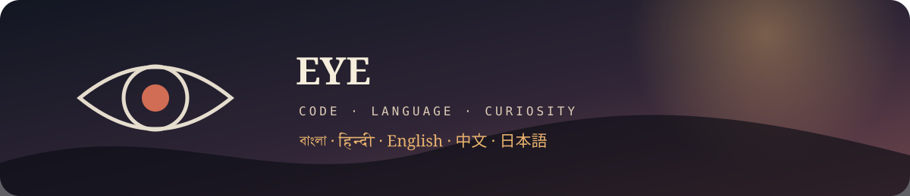

# Eye

### Building, translating, and learning one language at a time.

I am a developer and language learner interested in tools that sit between software, stories, and communication. I am currently building up my foundations across several programming languages while working on projects that are useful to me.

## What I Am Learning

| Language | Current focus |
| --- | --- |
| Java | Beginner to intermediate; object-oriented programming and problem solving |
| C++ | Building fundamentals and learning how systems-oriented code fits together |
| C | Exploring the foundations behind memory, programs, and operating systems |
| Rust | Next language on my learning path |
| Kotlin | Hoping to learn it soon, especially for modern JVM development |

My main goal is not to collect languages. It is to understand how different tools express the same ideas, and to become comfortable choosing the right one for a project.

## Languages I Speak

I am fluent to semi-fluent in five spoken languages:

**Bengali · Hindi · English · Mandarin · Japanese**

That multilingual background is a big part of why I enjoy translation tooling and localization. Working across languages changes how I think about precision, context, and the small details that make communication feel natural.

## Featured Project

### [DuskTranslate](https://github.com/eye9444/Dusk-Translate)

A self-contained browser workspace for translating Japanese light novels into readable English.

- Chapter-by-chapter source and translation panes
- Glossary support for names and terminology
- AI Studio and OpenRouter support
- TXT and EPUB workflows
- Light and Eclipse themes
- Current release: [DuskTranslate v0.1.0](https://github.com/eye9444/Dusk-Translate/releases/tag/v0.1.0)

## Other Work

- [WeeklyAssignments](https://github.com/eye9444/WeeklyAssignments): Java practice and coursework exercises

## Current Direction

Right now I am strengthening my programming fundamentals, learning how to structure projects cleanly, and turning experiments into tools I can actually use. I am especially interested in language learning, localization, developer tools, and the space where creative work meets software.

  <i>Still learning. Still building. Still translating ideas into something useful.</i>

